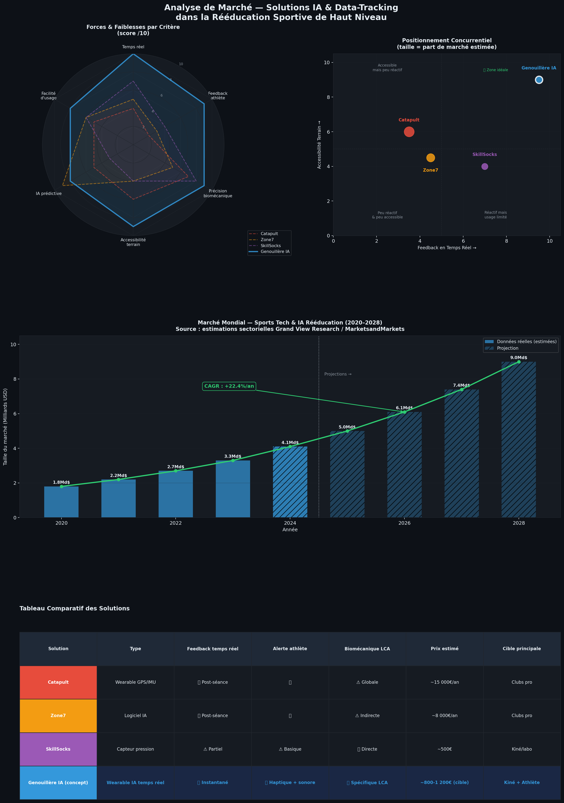

# 📈 Analyse Stratégique du Marché : IA & Rééducation post-opération

Cette section détaille l'opportunité de marché identifiée et le positionnement disruptif de notre solution de **Bio-Feedback IA** face aux géants actuels de la Sports Tech.

---

## 1. Dynamique du Marché : Une Croissance Portée par l'IA (CAGR +22.4%)
Le graphique de croissance souligne une transition majeure dans le milieu médical. Le passage de **1.8 Md$ en 2020 à une projection de 9.0 Md$ en 2028** ne s'explique pas seulement par l'achat de matériel, mais par la valeur de la donnée.

* **L'enjeu financier du "Return to Play" :** Pour un club pro, une semaine de retard dans la rééducation d'un joueur comme Antoine Dupont représente une perte financière sèche (salaire, billetterie, performance sportive). 
* **Optimisation des coûts cliniques :** Les centres de rééducation cherchent des outils permettant de monitorer plus de patients avec la même précision qu'un suivi individuel.
* **Démocratisation technologique :** L'IA permet aujourd'hui de transformer des capteurs abordables en outils de diagnostic de précision chirurgicale.

## 2. Le "Gap" Technologique : Pourquoi les leaders ne suffisent plus
L'analyse radar met en évidence un déséquilibre critique dans l'offre actuelle :

* **Le paradoxe Catapult/Zone7 :** Ces outils sont d'une précision inégalée pour la **macro-gestion** (charge de travail totale). Cependant, ils sont "aveugles" sur la **micro-mécanique** du genou durant l'exercice de rééducation. Le feedback arrive souvent trop tard (analyse post-séance), ce qui laisse le temps à l'athlète de consolider de mauvais schémas moteurs.
* **La faiblesse de l'accessibilité :** Comme le montre la matrice de positionnement, les solutions expertes demandent un investissement colossal (>15k€/an) et un personnel dédié pour interpréter les données. Cela exclut 90% des cabinets de kinésithérapie du sport et les sportifs individuels.

## 3. Positionnement Stratégique : L'Océan Bleu du Temps Réel
Ma proposition de **Genouillère IA** occupe le segment le plus stratégique : **Haute Précision + Haute Accessibilité + Feedback Instantané**.

* **Feedback Haptique & Proprioception :** Contrairement aux systèmes passifs, ma solution intervient sur le système neuromusculaire de l'athlète. Si l'IA détecte une instabilité, l'athlète le *sent* immédiatement. C'est une révolution pour la rééducation du LCA (Ligament Croisé Antérieur) où la confiance en l'appui est le principal frein.
* **Réduction de la "Latence Clinique" :** En automatisant l'analyse biomécanique, on permet au kinésithérapeute de se concentrer sur le soin manuel tout en laissant l'IA assurer la surveillance technique de l'exercice.

## 4. Synthèse Comparative des Avantages Concurrentiels

| Critères de Performance | Écosystème GPS/IA (Pro) | Capteurs de Pression | Concept Genouillère IA |
| :--- | :--- | :--- | :--- |
| **Temporalité du Feedback** | Différée (Post-séance) | Temps réel partiel | **Instantané (Live)** |
| **Correction Motrice** | Passive (Analyse) | Visuelle uniquement | **Active (Haptique/Sonore)** |
| **Précision Spécifique LCA**| Faible (Données globales) | Moyenne (Appui sol) | **Maximale (Angles articulaires)** |
| **Coût d'implémentation** | Très élevé (B2B Élite) | Modéré (B2B Kiné) | **Abordable (B2B & B2C)** |
| **Scalabilité** | Faible (Besoin d'experts) | Moyenne | **Haute (Application Grand Public)** |

---

### Conclusion de l'analyse
Le marché est mûr pour une solution qui déplace l'intelligence de l'ordinateur du Data Scientist vers le genou de l'athlète. La valeur ajoutée n'est plus seulement de **savoir** que le joueur est fatigué, mais d'**empêcher** le geste technique dangereux au moment où il se produit.
