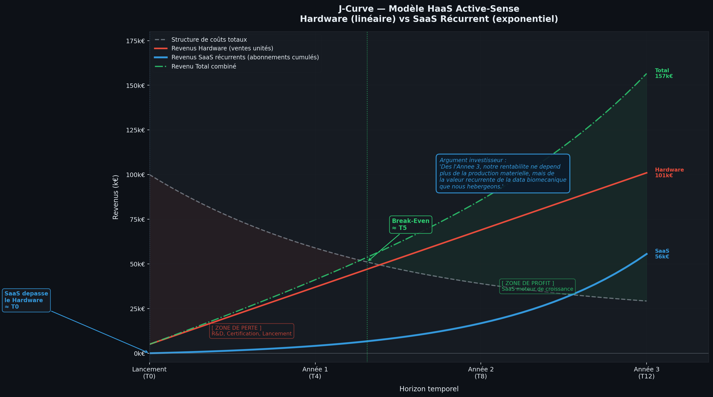

# 💰 Stratégie Commerciale & Modèle Économique
## Lancement de la Genouillère Connectée **Active-Sense**

> Transformer un concept MedTech en leader du marché de la réathlétisation d'élite — de la R&D au premier euro de revenus récurrents.

---

## 1. Business Model — Hardware-as-a-Service (HaaS)

La stratégie repose sur un modèle hybride : **vente d'équipement premium + revenus SaaS récurrents**. Trois segments adressés simultanément pour maximiser la couverture marché.

| Segment | Modèle | Offre | Prix Cible |
| :--- | :--- | :--- | ---: |
| 🏟️ **B2B Élite** — Clubs Pro, Fédérations | Vente + Abonnement SaaS | Genouillère + Dashboard Staff Médical (données équipe) | 1 500€/unité + 5 000€/an |
| 🏥 **B2B Kiné** — Cliniques, Cabinets | Location / Leasing | Matériel mis à disposition, facturable comme acte technique | 150€/mois/unité |
| 🧑‍⚕️ **B2C** — Sportif individuel post-op | Location courte durée | Location sur la durée critique de rééducation (3–6 mois) + app mobile | 80€/semaine |

**Pourquoi ce modèle ?**
Le HaaS génère de la **prévisibilité financière** (ARR stable) tout en abaissant la barrière à l'entrée pour les kinés indépendants qui ne peuvent pas investir 1 500€ en une seule fois.

---

## 2. Structure des Coûts

### 🔵 Capex — Investissements Initiaux

| Poste | Description | Priorité |
| :--- | :--- | :---: |
| **R&D & Prototypage** | IA embarquée (Edge Computing), capteurs IMU 1000Hz, itérations textiles | 🔴 Critique |
| **Certification Médicale** | ISO 13485 + Marquage CE — dossier technique + tests cliniques | 🔴 Critique |
| **Propriété Intellectuelle** | Brevet algorithme bio-feedback haptique + protection marque | 🟠 Élevée |

> ⚠️ Le Marquage CE n'est pas optionnel —  pour accéder au marché médical européen.

### 🟢 Opex — Coûts Annuels (Phase de Lancement)

- **Masse salariale :** Ingénieurs IA/Hardware, Biomécanicien référent, Technico-Commerciaux Santé
- **Production & Logistique :** COGS (fabrication), stockage, expédition
- **Marketing B2B :** Salons (Medica, congrès orthopédie), démos en clubs, comptes stratégiques

---

## 3. Financement — Levée de Fonds Seed

**Besoin total estimé : 1,2 M€** pour couvrir les Capex + 18 mois d'Opex.

```
┌─────────────────────────────────────────────────────────┐
│  Financement Public (30%)          →   360 000€         │
│  BPI France DeepTech, French Tech, Concours Innovation  │
├─────────────────────────────────────────────────────────┤
│  Levée Seed (70%)                  →   840 000€         │
│  Business Angels Santé/Sport + VCs Early-Stage          │
└─────────────────────────────────────────────────────────┘
```

**Conditions de la levée :**
- Valorisation pré-money cible : **4M€ – 6M€**
- Utilisation des fonds : finalisation Marquage CE · recrutement équipe commerciale · production des **100 premières unités pilotes**

---

## 4. Écosystème de Partenariats

Un produit MedTech ne se lance pas seul — la crédibilité clinique est un actif aussi important que le produit lui-même.

```
                    ┌──────────────────┐
                    │   Active-Sense   │
                    └────────┬─────────┘
           ┌─────────────────┼─────────────────┐
           ▼                 ▼                 ▼
   🏥 Cliniques          ⚙️ Fabricants      📦 Distributeurs
   CERS Capbreton        Textiles médicaux   Kiné / Orthopédie
   INSEP                 ISO 13485           (marché libéral)
   (validation + data)   (production)        (couverture B2B)
           │
           ▼
   👨‍⚕️ Prescripteurs Clés
   Chirurgiens orthopédiques LCA
   → Si convaincus, le patient loue la genouillère
```

---

## 5. KPIs & Objectifs de Croissance (Y1 → Y3)

| KPI | Année 1 | Année 3 | Ce que ça mesure |
| :--- | :---: | :---: | :--- |
| 📦 Unités en circulation | 50 *(pilotes)* | 1 000 | Pénétration marché |
| 💶 Revenu Récurrent (ARR) | 50k€ | 1,2 M€ | Part SaaS dans le CA |
| 🔄 Taux de fidélité B2B | — | > 90% | LTV clubs & cliniques |
| 🦵 Impact clinique | Symétrie validée à 95% | − 40% re-ruptures (prouvé) | Valeur médicale brute |

---

## 6. Mon Rôle : Technico-Commercial Santé

> En tant que futur **Technico-Commercial Santé**, mon objectif est de maximiser la **Lifetime Value (LTV)** des comptes B2B en assurant :
>
> - La **formation** des équipes médicales à l'outil
> - Le **suivi technique** post-déploiement
> - L'**évangélisation** auprès des prescripteurs clés (chirurgiens, kinés référents)
>
> Le commercial est le pont entre la technologie et l'adoption clinique réelle.
# 📊 Analyse Financière : Le Modèle HaaS (Hardware-as-a-Service)

L'adoption d'un modèle économique hybride (HaaS) est au cœur de la stratégie de viabilité d'**Active-Sense**. Ce modèle combine la vente d'équipements physiques (Hardware) avec des abonnements logiciels récurrents (SaaS). 

Le graphique en "J-Curve" ci-dessous modélise nos projections sur les 3 premières années (T0 à T12 trimestres).


*Figure 1 : Modélisation de la rentabilité croisée Hardware/SaaS et seuil de rentabilité.*

---

## 1. La Phase d'Amorçage : La "Zone de Perte" (T0 - T5)
Le graphique met en évidence une structure de coûts initiaux élevée (ligne en pointillés gris), démarrant à **100 k€** au lancement (T0). Cette "Zone de perte" classique en DeepTech est assumée et financée par la levée de fonds (Seed). 

* **Justification des coûts :** Ils englobent la R&D finale de l'IA embarquée, la production des premiers prototypes, et surtout le coût incompressible de la **Certification Médicale (Marquage CE)**.
* **Évolution :** Ces coûts de structure diminuent progressivement avec le temps grâce aux économies d'échelle et à la fin des lourds investissements de R&D initiaux.

## 2. Le Point de Bascule : Le Seuil de Rentabilité (Break-Even à ≈ T5)
Le point d'inflexion majeur du projet se situe autour du 5ème trimestre (T5). 
* À ce stade, le **Revenu Total combiné** (courbe verte) croise la courbe des coûts totaux. 
* L'entreprise devient financièrement autonome : les revenus générés par les premières ventes aux clubs d'élite et cliniques partenaires couvrent l'intégralité des charges opérationnelles.

## 3. Analyse des Flux de Revenus (Hardware vs SaaS)

### A. La Traction Matérielle : Le Hardware (Courbe Rouge)
* **Dynamique :** Croissance **linéaire**.
* **Objectif Année 3 :** Atteindre **101 k€** de revenus matériels.
* **Analyse :** La vente des genouillères est notre "cheval de Troie". Elle génère du cash-flow immédiat pour financer la production, mais sa croissance reste corrélée à nos efforts de production et de prospection commerciale.

### B. Le Moteur de Valeur : Le SaaS (Courbe Bleue)
* **Dynamique :** Croissance **exponentielle**.
* **Objectif Année 3 :** Atteindre **56 k€** de revenus récurrents annuels (ARR).
* **Analyse :** C'est ici que réside la véritable rentabilité. Chaque genouillère vendue génère un abonnement pour l'accès au Dashboard Data (utilisé par le staff médical). Les abonnements se cumulent mois après mois, avec une marge brute proche de 90%, car l'hébergement de la donnée coûte infiniment moins cher que la fabrication physique.

## 4. Vision Long Terme : La "Zone de Profit" (Années 2 & 3)
À partir de l'Année 2 (T8), l'entreprise entre dans une phase de rentabilité forte. 
* **Le Revenu Total Combiné (Courbe Verte)** se détache nettement pour atteindre **157 k€ à l'Année 3**.
* **L'Argument Stratégique :** Dès la troisième année, le modèle démontre que la rentabilité ne dépend plus uniquement de notre capacité à usiner du matériel. La valeur de l'entreprise bascule sur **l'exploitation récurrente de la data biomécanique** hébergée et analysée par notre IA.

---
> **En conclusion :** Ce modèle J-Curve prouve aux investisseurs que notre stratégie commerciale minimise le risque industriel à moyen terme, tout en maximisant la **LTV (Lifetime Value)** de chaque client B2B sécurisé.

> ⚠️ **Note Importante : Modélisation Illustrative**
> 
> Le graphique en J-Curve et les données présentées dans ce document ont une vocation démonstrative. Ils servent à illustrer la logique de rentabilité et la dynamique de notre modèle HaaS (le croisement entre la croissance linéaire des ventes Hardware et la croissance exponentielle des abonnements SaaS).
> 
> Pour consulter les données chiffrées exactes et le compte de résultat prévisionnel détaillé sur 5 ans (incluant CA, EBITDA, Cash-Flow cumulé et métriques SaaS), merci de vous référer au document financier dédié :
> 
> 📄 **[Consulter les Projections Financières](projections_financieres.md)**

*Document rédigé dans le cadre d'une veille stratégique MedTech & Sport-Santé.*
